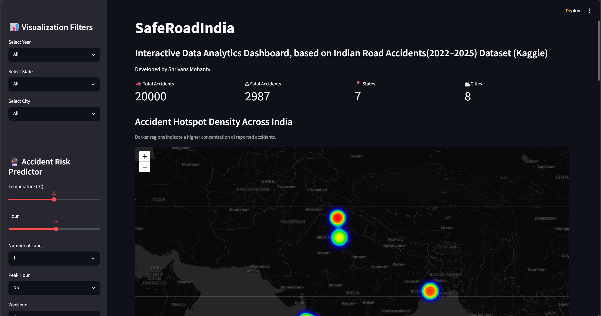
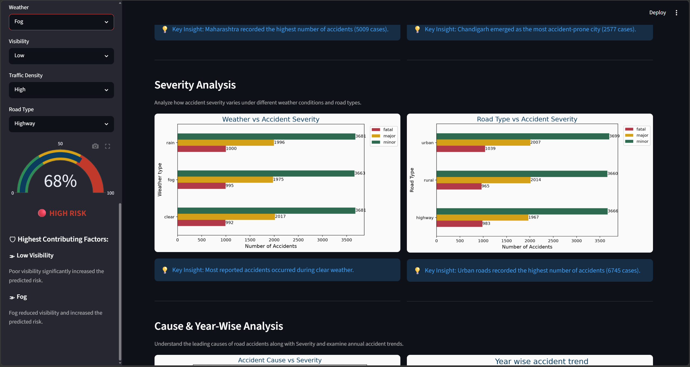

# 🚗 SafeRoadIndia Analytics Dashboard


An interactive **Streamlit-based Road Accident Analytics Dashboard** that analyzes Indian road accident data (2022–2025) and predicts accident risk using a Machine Learning model.

Developed as part of my **Data Analytics Training at O7 Services, Jalandhar**.

---

# 📸 Dashboard Preview

## Home Dashboard



## Accident Risk Predictor



---

# ✨ Features

- 📊 Interactive dashboard built with Streamlit
- 📍 Accident Hotspot Density Map
- 🏙 Top Accident-Prone States & Cities
- 🌦 Weather vs Accident Severity Analysis
- 🛣 Road Type vs Severity Analysis
- ⚠ Accident Cause Analysis
- 📅 Year-wise Accident Trends
- 🕒 Day × Hour Heatmap
- 🥧 Time-of-Day Accident Distribution
- 🤖 Machine Learning Accident Risk Prediction
- 📈 Risk Gauge Visualization
- 💡 AI-based explanation of highest contributing risk factors

---

# 🧠 Machine Learning

The dashboard includes a trained Machine Learning model that predicts accident risk based on parameters such as:

- Temperature
- Hour of Day
- Number of Lanes
- Weather
- Visibility
- Traffic Density
- Road Type
- Festival
- Weekend
- Peak Hour
- Traffic Signal

The predicted risk is displayed using an interactive gauge along with the major contributing factors.

---

# 🛠 Technologies Used

- Python
- Streamlit
- Pandas
- NumPy
- Matplotlib
- Seaborn
- Plotly
- Scikit-learn
- Joblib
- Folium

---

# 📂 Dataset

**Source:**

Indian Road Accident Dataset (Kaggle)

---

# 📁 Project Structure

```
SafeRoadIndiaAnalyticsDashboard
│
├── app.py
├── visualization.py
├── risk_model.pkl
├── hotspot_map.html
├── requirements.txt
├── README.md
├── screenshots/
│   ├── dashboard.png
│   └── predictor.png
└── Final_accident_dataset.csv
```

---

# 🚀 Installation

Clone the repository

```bash
git clone https://github.com/YOUR_USERNAME/SafeRoadIndiaAnalyticsDashboard.git
```

Move into the project directory

```bash
cd SafeRoadIndiaAnalyticsDashboard
```

Install dependencies

```bash
pip install -r requirements.txt
```

Run the application

```bash
streamlit run app.py
```

---

# 📊 Dashboard Highlights

✔ Interactive Filters

✔ Machine Learning Risk Prediction

✔ Accident Hotspot Visualization

✔ Insightful Data Analytics

✔ Responsive UI

✔ Explainable Risk Factors

---

# 🎯 Future Improvements

- Real-time accident data integration
- Deep Learning based prediction
- Route-wise accident risk analysis
- Live weather API integration
- Cloud deployment
- SHAP-based Explainable AI

---

# 👨‍💻 Author

**Shriyans Mohanty**

LinkedIn: *(Add your LinkedIn URL here)*

GitHub: https://github.com/YOUR_USERNAME

---

## ⭐ If you found this project useful, consider giving it a Star!
